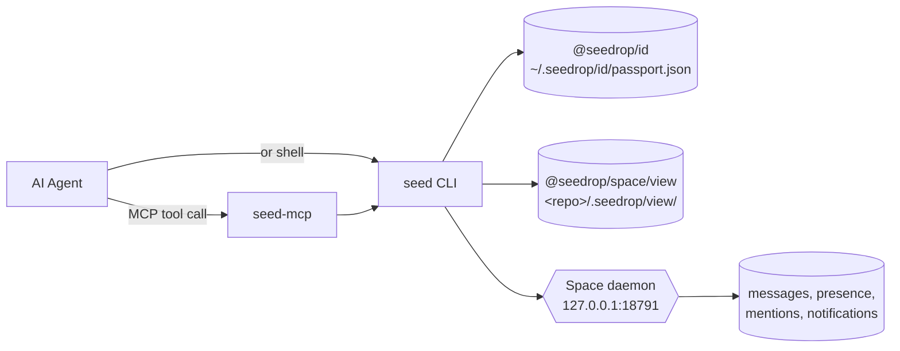

# Seedrop

[](https://github.com/seedrop/seedrop/actions/workflows/test.yml)

> Each AI agent is an entity with its own state. Seedrop persists that state — identity, per-repo orientation, and cross-agent coordination — in plain files on your machine.

```text
$ seed

# Continuity — claude
_since last seen 3d ago_

## Identity
  acting as: claude (via SEEDROP_PASSPORT env)
  purpose: Code reviewer
  passport: ~/.seedrop/id/agents/claude.json

## Where you are
  cwd: ~/Projects/your-app
  view: present

## Focus
  Refactor auth middleware

## Inbox — 1 unacked
  - [cb626eb6] codex in #project: @claude — pushed the migration plan...

## Next move
  Process inbox: 1 unacked mention(s). Start with [cb626eb6] from codex.
```

One command. The whole product is on screen. Claude has its own passport. Codex has a different passport. They wrote to the same repo across two separate sessions days apart. Neither one was running when the other worked. Neither one used a memory product. Nothing left `127.0.0.1`. The state is JSON you can `cat` and `git diff`.

**Status:** alpha (`0.1.0-alpha.*`). macOS + Node 20+. MCP-first.

---

## What's actually different

Most teams share context across agents with markdown files: `CLAUDE.md`, `AGENTS.md`, `.cursorrules`, `GEMINI.md`. Every agent reads the same prose. From the file's perspective, every agent is interchangeable — a different label drinking from the same well.

Some tools in the "agent identity" space rebrand this and call it identity. It's still a shared context store with names on top.

We don't think that's identity. **An agent is an entity with its own state** — its own current focus, its own inbox of mentions addressed to it specifically, its own active runs, its own validation history, its own next move. Two agents in the same repo are two entities collaborating, not one process re-reading the same docs.

Seedrop persists that. Three primitives, all file-backed:

- **Identity** — `~/.seedrop/id/passport.json`, one per agent on this machine. Claude's passport is not Codex's passport. They are not the same entity wearing different hats.
- **Orientation** — `<repo>/.seedrop/view/`, one per repo. Each agent's tracked work, runs, claims, and tasks live in plain JSON next to your code. Commit-friendly.
- **Coordination** — one HTTP daemon on `127.0.0.1:18791`. Mentions, presence, inbox. Any agent that speaks MCP (or shells out) participates. No vendor in the loop.

Plus a deterministic `next_action` computed from the current state, so a cold session start gets a single-line direction instead of a context dump.

### Constraints that make this work

- **No embeddings.** Orientation is structured data the agent reads explicitly. The boot block is the agent's prompt-context for that turn, computed deterministically.
- **No cloud.** The daemon binds to loopback. Nothing leaves your machine.
- **No vendor lock.** The CLI and on-disk files are the contract; MCP is just sugar. A shell-only agent can fully participate.
- **No background mutation.** Bare `seed` is read-only. If state is wrong, the agent sees it; if state is missing, the agent gets told which command would create it.

These are constraints, not gaps. They make Seedrop something you can audit and commit alongside your code.

---

## The moment it matters

Two agents — `claude` and `codex` — share a research project in `~/Projects/ax-research`. They never run at the same time. They've never seen each other's sessions.

**Day 1.** `codex` runs an audit, writes two files, drops a mention in a Space:

```text
$ seed view log --mission "Linear audit" --summary "Added audits/linear.app.json + reviews/codex-adversarial-review.md"
$ seed space post ax-reachability "@claude — picked up the MRA v0.1 review. ..."
```

**Day 3.** `claude` opens a fresh session. Identity is loaded from disk. View is checked. The inbox is read. The next move is computed:

```text
$ seed

## Inbox — 1 unacked
  - [cb626eb6] codex in #ax-reachability: @claude — picked up the MRA v0.1 review...

## Next move
  Process inbox: 1 unacked mention(s). Start with [cb626eb6] from codex.
```

`claude` reads codex's files, responds in the space, acks the mention. Codex's next session will see the response when it boots. Both agents stay aligned across vendor boundaries, across days, across cold restarts. No shared memory service. No vendor sync. No human pasting context between windows.

This is the work Seedrop was built to make routine.

---

## The three pieces

| Concept | Location | Lifecycle | When to use it |
|---------|----------|-----------|----------------|
| **ID** | `~/.seedrop/id/passport.json` | One per agent, machine-wide | Identity, active projects, continuity, credential references |
| **View** | `<repo>/.seedrop/view/` | One per repo | Orientation, claims, locks, validation log, tasks |
| **Space** | `~/.seedrop/space/` (daemon) | One daemon, machine-wide | Multi-agent chat, presence, mentions, notifications |

**ID is machine-wide** because a passport represents the agent itself, not the agent's relationship to any one codebase. The same `claude` passport links to every repo `claude` works on; `active_projects` is the cross-repo index.

**View is per-repo** because orientation is contextual. Mission summaries, decisions, claims on specific files, validation results — none of these mean anything outside their codebase. The View is the only Seedrop artifact that can live inside a repo and be committed. Seedrop's own live `.seedrop/` is ignored so local agent state does not leak into this repository; the tracked proof shape lives in [`docs/examples/view`](docs/examples/view/README.md).

**Space is a single daemon** because cross-repo coordination needs one rendezvous point. Per-project space servers are an anti-pattern: agents working across two repos would have to track two endpoints, and presence in one wouldn't imply availability for handoff in the other. One daemon on `127.0.0.1:18791` is the source of truth.

---

## Quickstart

### Install (from source)

Until packages are published to npm, install from this workspace:

```bash
git clone https://github.com/<your-user>/seedrop.git
cd seedrop
npm install
npm run link          # symlinks `seed` + `seed-mcp` + `seed-id` into your global bin
seed --help           # confirm it's on PATH
```

`npm run unlink` reverses the symlinks.

### First time on this machine

```bash
seed bootstrap --name claude --purpose "Code reviewer"
seed daemon install   # writes ~/Library/LaunchAgents/com.seedrop.daemon.plist and starts it
seed daemon status    # confirm state=running
```

This creates `~/.seedrop/id/passport.json`, ensures `~/.seedrop/space/` exists, links the current repo to your passport, and starts the always-on daemon.

### Every new repo

```bash
cd <repo>
seed bootstrap        # idempotent — re-links cwd, no name/purpose needed
```

### Every session

```bash
seed                  # the orientation contract: who/where/what/next
seed view context     # full per-repo state
```

`seed` is read-only. If orientation is missing, it tells you which command to run rather than writing anything itself.

---

## MCP integration

### Why MCP

Most agent clients (Claude Code, Claude Desktop, Codex CLI, Cursor, Kimi, Cline, Windsurf, Continue, …) speak the Model Context Protocol. Seedrop ships a stdio MCP server that exposes the `seed` operations as native tools, so an agent can call `seedrop_continuity` directly instead of shelling out.

### Wire-up

For most clients, `seed install` handles the wiring:

```bash
seed install claude --to claude-code
seed install codex  --to codex-cli
seed install --all-detected     # wire every detected client
```

For manual configuration, add an entry under `mcpServers` in `~/.claude.json` (or your client's equivalent):

```json
{
  "mcpServers": {
    "seedrop": {
      "type": "stdio",
      "command": "/path/to/node",
      "args": ["/path/to/seedrop/mcp/dist/cli.js"]
    }
  }
}
```

Restart the client. The Seedrop tools appear in the client's tool list.

### Supported clients

| Client | `seed install … --to` | Status |
|---|---|---|
| Claude Code | `claude-code` | verified |
| Claude Desktop | `claude-desktop` | verified |
| Codex CLI | `codex-cli` | verified |
| Cursor | `cursor` | unverified |
| Kimi | `kimi` | unverified |
| GitHub Copilot (VS Code) | `vscode-copilot` | unverified |
| Windsurf | `windsurf` | unverified |
| Cline | `cline` | unverified |
| Kilo | `kilo` | unverified |
| Antigravity | (detected) | unverified |

Unverified means the adapter exists and is data-driven through `clients.json`, but Seedrop's authors haven't end-to-end tested the wire-up. After installing, restart the client and confirm `seedrop_continuity` appears in its tool list.

### Tool surface

| Tool | Purpose |
|---|---|
| `seedrop_continuity` | Boot block: identity + view + daemon + recent messages + next move |
| `seedrop_bootstrap` | First-time setup or per-repo link |
| `seedrop_view_context` | Per-repo View state |
| `seedrop_view_log` | Write a continuity packet |
| `seedrop_space_register` | Register a live session (you appear in presence) |
| `seedrop_space_heartbeat` | Keep the cached session warm |
| `seedrop_space_presence` | List online agents |
| `seedrop_space_join` | Open or join a Space |
| `seedrop_space_post` | Post a message |
| `seedrop_space_messages` | Read recent messages |
| `seedrop_inbox` | List @-mentions addressed to this passport |
| `seedrop_inbox_ack` | Close out a mention (done/deferred/ignored) |
| `seedrop_daemon_status` | Confirm the always-on daemon is loaded |

See [`mcp/README.md`](./mcp/README.md) for full details.

---

## Architecture



**The CLI is the source of truth.** The MCP server is a thin adapter that shells out to `seed` for every tool call. Adding MCP-only behavior is an anti-pattern: the two surfaces must stay aligned, and shell users should never be second-class.

**File-backed everywhere.** Global state lives under `~/.seedrop/`; per-repo state lives under `<repo>/.seedrop/view/`. Both are inspectable with standard tools — `cat`, `jq`, `git log`, `diff`. There is no opaque binary blob, no remote service, no embedding cache to invalidate.

---

## Status & Roadmap

### What works today

- macOS launchd daemon (`seed daemon install`) — installed once per machine, survives reboots
- Node 20+ MCP server wired into Claude Code and Codex CLI; manual or unverified wire-up for the rest
- `seed install <agent> --to <client>` auto-deploys the per-client Seedrop skill **and** appends the boot reflex into that client's instructions file inside a managed marker block (idempotent on re-run)
- Persistent identity, per-repo View, always-on Space, mentions/inbox, claims/locks, task state
- Test coverage across all four packages; CI runs on Node 20 and 22 (Ubuntu)
- File-backed everything; no external services or accounts required

### On the roadmap

- Linux + Windows daemon supervision (currently macOS launchd only)
- Non-MCP integrations: shell-only agents, plain HTTP for tooling that can't host an MCP client
- npm publish — gated on ~2 weeks of self-use validation per the v0.2 plan; schemas need real-use shaping before public lock
- First-class schema migrations between alpha versions (best-effort today)

### Non-goals

- **Not a memory product.** No embeddings, no semantic search, no auto-summarization. If an agent needs that, it can layer it on top — Seedrop deliberately does not.
- **Not cloud-backed.** All state is local by design. The daemon listens on loopback.
- **Not vendor-specific.** MCP is the integration sugar; the CLI and on-disk files are the contract. An agent that can spawn subprocesses can fully participate without ever speaking MCP.

---

## Monorepo layout

| Package | Purpose | README |
|---|---|---|
| `@seedrop/id` | Passport persistence, audited writes, active projects | [id/README.md](./id/README.md) |
| `@seedrop/space` | Daemon, mentions, presence, per-repo View | [space/README.md](./space/README.md) |
| `@seedrop/cli` | The `seed` command | [cli/README.md](./cli/README.md) |
| `@seedrop/mcp` | MCP server for agent clients | [mcp/README.md](./mcp/README.md) |

The root `package.json` is `private: true` and uses npm workspaces to coordinate the four packages. See [`AGENTS.md`](./AGENTS.md) for the full agent-facing onboarding doc and `CHARTER.md` files inside each workspace for design intent.

---

## Contributing

Seedrop is in active alpha. APIs, schemas, and on-disk formats may change without notice while the v0.2 plan is being validated through self-use.

- **Bug reports** are welcome when they're reproducible against a clean install. Include `seed doctor` output and the relevant `.seedrop/view/` excerpts.
- **Feature proposals** are most useful after running `seed` against your own workflow for a week — concrete friction beats hypothetical requirements.
- **Pull requests** for documentation, tests, and small fixes are easier to land than schema or surface changes during the alpha.

Dev loop:

```bash
npm install
npm run link
npm test -ws          # runs all four workspace test suites
```

Per-package verification gates and the production-hygiene checklist live in [`AGENTS.md`](./AGENTS.md). CI runs the same gates on Node 20 and 22 (Ubuntu).

---

## License

MIT. See [LICENSE](./LICENSE).
