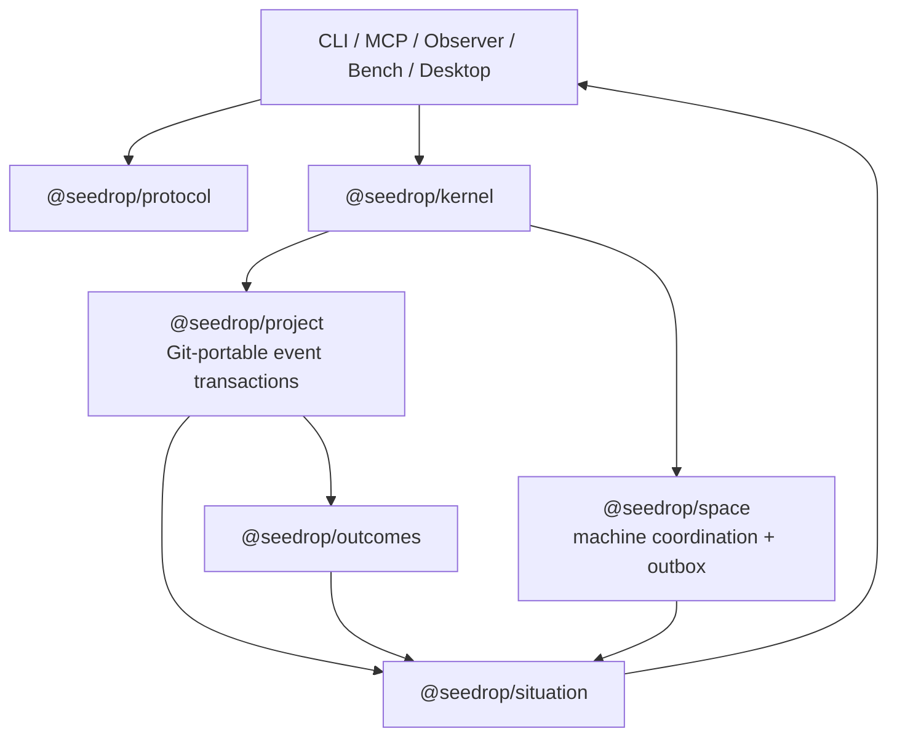

# Seedrop v2 — Evidence-Based Execution Plan

**Plan class:** Evidence-Based Plan  
**Evidence:** [system forensics](./SYSTEM-FORENSICS.md), [machine evidence](./MACHINE-EVIDENCE.md), and [product/architecture thesis](./README.md)  
**Objective:** make Seedrop unable to report a confident continuity state that its canonical evidence cannot support  
**Main-path boundary:** `seedrop_db` remains an independent experiment. No v2 task depends on it; reconsideration requires separately preregistered, reproducible evidence of approximately 10× end-to-end Seedrop product value.

**Execution status (2026-08-09):** Wave 0 is complete. DC-01 froze the durable v1 authority, DC-02 sealed and restore-tested the migration corpus, and DC-13 reconciled the live backlog. The Wave 0 gate authorizes materializing Wave 1A/1B containment tasks; it does not authorize v2 write cutover. See the [durable-v1 freeze](./DURABLE-V1-FREEZE.md), [snapshot proof](./SNAPSHOT-RESTORE.md), and [backlog ledger](./BACKLOG-RECONCILIATION.md).

Evidence references below use `F1`–`F5` for sections 1–5 of [system forensics](./SYSTEM-FORENSICS.md) and `M` for [machine evidence](./MACHINE-EVIDENCE.md). Each table's finding/state/failure cell is its `Addresses: [forensic finding]` trace. Timing is `Immediate`, `Short-Term`, `Medium-Term`, or `Long-Term`. Owners are responsibility domains, not assumed individuals.

The catalog is complete for the currently evidenced v2 scope. New work enters only when it repairs a mapped finding or an accepted ADR changes the scope. The live Seedrop task queue is populated one gated wave at a time; this document is the canonical catalog, not a mandate to create every task immediately.

## 1. Damage Containment

### Immediate containment table

| ID | Timing | Finding | Ongoing damage? | Containment action and exit evidence | Owner | Risk of containment | Rollback condition |
| --- | --- | --- | --- | --- | --- | --- | --- |
| DC-01 | Immediate | schema and ontology drift (`F2/schema evolution`, `F4/migration`) | yes | Freeze new durable v1 fields, statuses, and primitives except safety repairs; CI rejects unversioned durable-schema additions. Exit: protocol ADR accepts v2 replacements. | Protocol | feature work pauses | accepted v2 schema/version policy |
| DC-02 | Immediate | migration may destroy ambiguous history (`F3`, `M/corpus`) | yes | Snapshot every meaningful View, passport, and daemon store; record byte counts, file counts, hashes, permissions, and restore instructions. Exit: restore drill succeeds on a copy. | Migration | storage and privacy exposure | verified encrypted/permissioned backup supersedes snapshot |
| DC-03 | Immediate | parse failure becomes absence (`F2/View read`, `M/schema errors`) | yes | Change all artifact-family readers to return valid records plus typed diagnostics; never silently skip. Exit: each corrupt-family fixture preserves valid siblings and names the corrupt path. | Project state | callers must handle partial results | v2 compatibility reader proves identical or stronger diagnostics |
| DC-04 | Immediate | audit certifies incomplete state (`F3/Health`, `M/schema errors`) | yes | Extend audit to Tasks, Runs, packets, Signals, policy, manifest, knowledge, archives, and indexes. Exit: the two known malformed tasks are reported by exact path/reason. | Project state | audits become non-green | no rollback until equivalent v2 invariant check exists |
| DC-05 | Immediate | `completed` is promoted to proof (`F1`, `F4/completion`, `M/delivery`) | yes | Remove `committed_proof` from self-reported completion; emit reported/evidence/delivery facts separately. Exit: completed-uncommitted fixtures never receive committed trust. | Situation | lower apparent confidence | only after fresh receipt-based trust model ships |
| DC-06 | Immediate | terminal tasks can reopen; ergonomic IDs persist invalidly (`F2/task transitions`, `M/schema errors`) | yes | Centralize v1 transition guards and resolve prefixes to canonical UUIDs before persistence. Exit: full invalid-edge table and persisted-prefix regression tests pass. | Kernel compatibility | breaks unsafe legacy behavior | explicit compatibility flag during bounded migration only |
| DC-07 | Immediate | local Space assumes authorization (`F2/Space`, `F4/one process`) | yes | Add membership authorization, default deny for protected routes, and hard request-body limits with stable errors. Exit: non-member and oversized request tests pass. | Daemon/Security | older clients may fail | versioned compatibility route with warning, time-bounded |
| DC-08 | Immediate | daemon store uses two root meanings (`F3/Coordination`, `M/root defect`) | yes | Implement previewed backup/migration from nested root to one canonical data root; preserve old root read-only. Exit: counts/hashes reconcile and rollback drill passes. | Daemon/Migration | daemon downtime/data movement | restore manifest points daemon to old root |
| DC-09 | Immediate | inspection advances continuity watermark (`F2/continuity read`, `F4/read is observational`) | yes | Stage watermark and presence effects; commit watermark only after all required fetches succeed. Exit: injected fetch failure leaves watermark unchanged. | CLI/Daemon | duplicate visibility until ack | revert to explicit peek-only mode |
| DC-10 | Immediate | message/mentions partial commit duplicates effects (`F2/message post`) | yes | Add stable request id and duplicate suppression before the full outbox lands. Exit: retry after mention failure produces one logical message. | Daemon | retention of dedup metadata | remove only after TX-07/TX-12 pass |
| DC-11 | Immediate | Desktop child can deadlock (`F2/Desktop bridge`) | yes | Drain stdout/stderr concurrently, cap decoded output safely, and escalate termination. Exit: large-output and hung-child tests finish deterministically. | Desktop | changes error timing | keep old bridge behind dev-only flag until tests pass |
| DC-12 | Short-Term | daemon runs mutable workspace source (`F1/runtime`, F4/tests) | yes | Pin installed daemon to a sealed runtime/build hash and report it in health. Exit: daemon restarts without source workspace/toolchain. | Release/Daemon | developer loop changes | source-first dev profile remains explicit and non-release |
| DC-13 | Immediate | backlog contains duplicates, stale strategy, release authority, and off-track DB work (`M/queue`) | yes | Reconcile existing tasks: map to catalog IDs, merge duplicates, drop superseded/off-track work, keep external release authority separate. Exit: every open task has disposition, owner or gate, and no DB task blocks v2. | Product/Program | historical intent may look closed | dropped tasks remain durable and reopen only by explicit decision |

Containment is allowed to make unsafe behavior fail loudly. Compatibility is preserved only where it does not reintroduce hidden loss, false proof, unauthorized access, or ambiguous writes.

**Critical question answer:** the smallest risk-reducing change is to stop silent loss and false trust immediately: readers return diagnostics, completion loses proof status, illegal transitions are rejected, Space denies unauthorized requests, and all migration targets are snapshotted before v2 writes begin.

## 2. Make the Invisible Visible

### Detection and observability plan

| ID | Timing | Hidden condition | Detection signal | Instrumentation point | Normal value | Alert condition | Owner | Temporary/permanent |
| --- | --- | --- | --- | --- | --- | --- | --- | --- |
| VI-01 | Short-Term | substrate/projection health is fragmented (`F1`, `F3/Health`) | one versioned `HealthEnvelope` with substrate, source watermarks, quarantines, stale projections, pending commands, and budget | protocol plus every read response | healthy or explicitly degraded with reasons | unknown/missing source or incompatible projection | Protocol/Situation | permanent |
| VI-02 | Immediate | corrupt artifacts disappear (`F2/View read`) | `records + diagnostics + completeness` result type | all View list/read functions | zero unaccounted parse failures | any file omitted without diagnostic | Project state | permanent |
| VI-03 | Short-Term | half-completed commands (`F2/run finish`, messages, passport) | command audit record: command id, principal, project, idempotency key, expected/result version, phase, error | kernel executor and compatibility adapters | every started command reaches terminal or recoverable phase | command idle past policy or phase has no recovery owner | Kernel | permanent |
| VI-04 | Short-Term | source disagreement/freshness (`F1/12`, `F5`) | source high-watermark, content digest, observed time, governing record id | manifest, Git observer, daemon, project projection, Situation | consumers name same or intentionally lagged source | conflicting governing claims or lag over policy | Situation/Outcomes | permanent |
| VI-05 | Immediate | boot/preflight/audit disagree (`F3/Orientation`, existing live mismatch) | disagreement diagnostic with both values, timestamps, and chosen policy | boot/focus/continuity/Bench | no unexplained disagreement | values differ without an explicit resolution trace | Situation | permanent |
| VI-06 | Short-Term | abandoned Runs, stale leases, orphan Tasks/Episodes (`F1/7`, `M/negative knowledge`) | age/state invariant queries and sweep candidate events | project index and daemon scheduler | no terminally impossible or ownerless-active record | threshold exceeded or relationship missing | Project state | permanent |
| VI-07 | Medium-Term | retry/lost update/outbox failures (`F2`) | counters and spans for duplicate idempotency, CAS conflicts, retries, outbox lag, dead letters | kernel/store/outbox | bounded retries; zero lost-CAS; outbox within SLO | poison item, retry storm, or lag above SLO | Kernel/Daemon | permanent |
| VI-08 | Short-Term | repairs are invisible (`F3/Health`) | append-only repair journal naming evidence, operator, before/after hashes, command, rollback | doctor/migrations/quarantine | every mutation has receipt | repair without journal or unverifiable before state | Migration | permanent |
| VI-09 | Medium-Term | operators cannot explain a Situation claim (`F3/Orientation`) | `seed doctor --explain <field-or-decision>` trace to event, receipt, policy, and projection version | CLI over shared explanation API | every material field resolves or says unknown | missing provenance for a confident field | Situation/CLI | permanent |
| VI-10 | Short-Term | requested budget differs from work/output (`F4/budget`, `M/context`) | requested bytes, actual bytes, completeness, candidate counts, index/scanned counts | compiler and boot receipts | actual ≤ requested; bounded reads | output overflow or full-history scan on bounded path | Situation | permanent |
| VI-11 | Medium-Term | telemetry could become undeclared collection | consent/configuration receipt and local-only default; exported schema/version visible | daemon/CLI setup and exporter | off unless explicitly enabled | export without consent or secret-pattern detection | Release/Security | permanent |

The canonical health contract is:

```ts
type HealthEnvelope = {
  substrate: "healthy" | "degraded" | "corrupt" | "migrating" | "unreachable";
  projectionVersion: string;
  sourceHighWatermarks: Record<string, string>;
  quarantined: Array<{ kind: string; path: string; code: string; repair?: string }>;
  stale: Array<{ projection: string; observedAt: string; reason: string }>;
  pendingCommands: Array<{ id: string; phase: string; recoverable: boolean }>;
  budget: { requestedBytes: number; actualBytes: number; complete: boolean };
};
```

Logs are supporting evidence, never authoritative truth. Security, migration, corruption, and transition invariants must be queryable as structured records.

**Critical question answer:** Seedrop must measure artifact accounting, command phase, source high-watermarks, projection lag, reconciliation disagreements, CAS/idempotency outcomes, outbox lag, repair history, and exact budget behavior. Without those, a green surface cannot prove the underlying failure stopped.

## 3. Restore Source of Truth

### Truth restoration and implementation catalog

| ID | Timing | State | Current truth sources | Target authority | Reconciliation rule | Migration/backfill and verification | Owner |
| --- | --- | --- | --- | --- | --- | --- | --- |
| TR-01 | Short-Term | v2 ontology/invariants (`F1`, `F3`) | Tasks, Runs, packets, handoffs, Signals, docs | accepted `@seedrop/protocol` ADR | public nouns are Principal, Project, Intent, Episode, Claim, Receipt, Lease, Event, Situation | map every v1 noun/status; ADR includes rejected alternatives and invariants | Protocol/Product |
| TR-02 | Short-Term | package ownership (`F3/space concentration`) | most domain behavior in `space` | modular monolith packages: `protocol`, `kernel`, `project`, `situation`, `outcomes`; `space` narrows to daemon coordination | dependencies point inward to protocol; adapters own no semantics | dependency-cycle test and package contract tests | Architecture |
| TR-03 | Short-Term | IDs/serialization/errors (`F2/schema`, `F3/contract`) | ad hoc UUID/prefix/string errors | protocol-generated stable IDs, canonical JSON bytes, error registry | prefixes resolve only at input; storage/wire use full canonical IDs | golden schemas/bytes/errors across Node versions | Protocol |
| TR-04 | Short-Term | versions/migrations (`F4/migration`) | durable schemas fixed at `1.0`; empty chains | explicit schema, semantic, command, projection, and wire versions plus ordered migrations | unknown versions fail typed; no implicit field acceptance | migration graph has no gaps; downgrade/rollback boundary documented | Protocol/Migration |
| TR-05 | Short-Term | principal identity (`F2/principal`, `F4/aliases`) | passport id, agent id, name, raw headers | canonical Principal ID with versioned alias registry | resolve before authorization/persistence; ambiguity default-denies | import all nine passports; alias permutations yield one principal | Identity/Security |
| TR-06 | Short-Term | project identity (`F3/registry`) | passport roots, cwd, Desktop inventory | canonical Project ID plus repo/worktree/root aliases | repo identity wins; worktrees are explicit placements, not new projects | deduplicate ~24 roots with manual queue for ambiguous cases | Project/Identity |
| TR-07 | Short-Term | project event truth (`F2/multi-artifact command`, `F5`) | mutable Runs/Tasks/packets/signals | one immutable content-addressed command transaction file per atomic project write | same canonical bytes are Git truth; local index is disposable | golden event bytes; clone/import reproduces digest and projection | Project/Kernel |
| TR-08 | Short-Term | domain records (`F1/state machine`) | separate files and implicit axes | versioned events for Intent, Episode, Claim, Receipt, Lease, Grave, repair and invalidation | corrections append; historical reports are never overwritten | property tests cover every accepted/rejected transition | Protocol/Kernel |
| TR-09 | Short-Term | work intent (`F3/Intent`) | Tasks, run goals, packet threads, handoffs | Intent event stream | deterministic links win; ambiguous links remain `unresolved`, never guessed | import all Tasks/handoffs/threads with counts and unresolved list | Project/Migration |
| TR-10 | Short-Term | execution/reasoning (`F3/Execution/Reasoning`, `M/dual write`) | Run files plus packets | one Episode stream with steps, decisions, assumptions, threads, changed paths, receipts | packet/run merge only with evidence; otherwise related unresolved claim | corpus reconciliation proves no field silently lost | Project/Migration |
| TR-11 | Short-Term | lifecycle/evidence/delivery/readiness (`F1`, `F4/L-level`) | one Run status, proof labels, L0–L4 | orthogonal lifecycle, evidence, delivery, substrate health, handoff readiness, confidence axes | policy derives readiness; axes remain visible | truth table covers all observed combinations, including completed+uncommitted | Protocol/Situation |
| TR-12 | Short-Term | validation and delivery (`F3/Delivery/Validation`) | Run/packet text and Git inference | immutable Receipt and OutcomeObservation events | observer evidence never rewrites report; latest applicable observation governs projection | import existing outcome layer with observer/time/input/build identity | Outcomes |
| TR-13 | Short-Term | coordination (`F3/Coordination`) | daemon SQLite/files, sessions, passport membership | machine-global transactional daemon store | membership is durable authority; presence is TTL projection; inbox/outbox transactional | migrate nested root and reconcile memberships/messages/notifications | Daemon |
| TR-14 | Medium-Term | orientation (`F3/Orientation`, `F5`) | boot, focus, continuity, Observer, Bench, Desktop policies | `@seedrop/situation` deterministic compiler over read ports | no independent truth; every field carries provenance/freshness/completeness | golden same-input Situation bytes and decision id across adapters | Situation |
| TR-15 | Medium-Term | repository observation (`F4/manifest scan`) | full recursive sync and stale manifest | incremental content observer plus disposable index | source digest invalidates dependent Claims; scan fallback explicit and bounded | 38k-file regression shows incremental work and correct invalidation | Project/Outcomes |
| TR-16 | Short-Term | v1 migration authority (`M/corpus`) | mutable live files | source snapshot + migration receipt + v2 events; originals become read-only during shadow | source snapshot governs disputes; no destructive repair without receipt | all 17 meaningful Views reconcile counts/hashes/quarantines | Migration |
| TR-17 | Medium-Term | compatibility | v1 CLI/MCP file mutations | read-only v1 adapter plus v1-command-to-v2-command translators | compatibility at edge; no v1 semantics inside kernel | differential old/new projections before cutover | Adapter/Migration |

Target package direction:



The physical main-path choice is intentionally conservative: canonical repo events remain plain, immutable, content-addressed files; a local SQLite index may accelerate reads but is disposable. Machine-global coordination remains transactional SQLite. This plan does not depend on a custom database.

**Critical question answer:** after redemption, project truth is the canonical content-addressed event transaction set; coordination truth is the daemon transaction store; Git/CI are external authorities represented by immutable observations; Situation and every UI are disposable, versioned projections with source watermarks.

## 4. Repair State Transitions

### Transition repair plan

| ID | Timing | Transition | Current failure mode | Target shape and atomicity boundary | Idempotency/recovery | Required test | Owner |
| --- | --- | --- | --- | --- | --- | --- | --- |
| TX-01 | Short-Term | every command (`F2`) | bespoke multi-write flows | one executor: resolve principal → authorize → validate → expected-version check → durable command transaction → projections → outbox → terminal receipt | command id + idempotency key; recover from explicit phase | crash after every phase yields enumerated state | Kernel |
| TX-02 | Short-Term | authorization/validation | some effects precede complete validation | no durable effect before principal, membership, schema, and transition checks pass | rejected key may be safely retried after input change | unauthorized/invalid input creates zero event/effect | Kernel/Security |
| TX-03 | Short-Term | concurrent project write (`F4/one process`) | read-check-overwrite races | cross-process project lock plus expected snapshot digest and compare-and-set publish of one transaction file | conflict returns current snapshot/evidence; bounded stale-lock recovery | 2/8/32 writer stress has no lost update | Project/Kernel |
| TX-04 | Short-Term | duplicate command/task create/message | scan-then-create races | unique idempotency record scoped by principal/project/command kind | same key+payload returns receipt; same key+different payload conflicts | concurrent duplicate storm creates one logical outcome | Kernel |
| TX-05 | Short-Term | project event append | several artifacts mutate independently | canonical transaction contains all domain events; temp write, file sync, atomic publish, directory sync before ack | uncommitted temp is ignored/recovered; committed file immutable | crash matrix exposes whole transaction or none | Project |
| TX-06 | Short-Term | projection advancement | readers independently derive partial state | deterministic reducers consume committed event set and publish version/watermark | disposable rebuild and tail catch-up; typed projection lag | delete/rebuild gives byte-identical projection | Project/Situation |
| TX-07 | Short-Term | external/secondary effects | side effect can precede authoritative completion | durable outbox entry committed with canonical event; dispatcher runs afterward | effect key deduplicates; retry/dead-letter/manual repair states | failure at each delivery point yields exactly-once logical result | Kernel/Daemon |
| TX-08 | Short-Term | process restart | absence of error implies completion | boot recovery enumerates `started`, `canonical_committed`, `effects_pending`, `completed`, `failed`, `needs_repair` | replay/resume by command id; never guess | restart corpus for every phase | Kernel |
| TX-09 | Short-Term | Intent lifecycle (`F2/task`) | permissive assignments/resurrection | generated transition table; terminal correction is a new event | expected version and explicit reopen authority | all invalid edges rejected; valid graph covered | Protocol/Kernel |
| TX-10 | Short-Term | Episode lifecycle (`F2/run finish`) | finish releases claims/posts tasks/syncs before final write | one Episode transition transaction; releases/handoff/outcome observation are events/outbox effects | finish retry returns same receipt; partial effects resume | crash matrix over finish and handoff | Kernel/Project |
| TX-11 | Short-Term | Lease claim/release/expiry (`F3/Concurrency`) | Signal, task owner, Run, presence may contradict | versioned lease event with exclusive target/version and expiry; ownership projection derives from it | claim CAS; expiry/correction append events | simultaneous claim has one winner; stale lease visible | Kernel/Project |
| TX-12 | Short-Term | Space post + mentions (`F2/message`) | separate persistence creates duplicates/omissions | SQLite transaction for post/outbox mentions; notification delivery after commit | request/effect keys; dead-letter and repair | injected failures produce one post and all-or-explicit-pending mentions | Daemon |
| TX-13 | Short-Term | passport update (`F2/passport`) | some paths bypass journal | every identity mutation uses one commit journal/transaction and canonical alias resolution | update command id and expected passport version | concurrent update/crash preserves passport+audit agreement | Identity |
| TX-14 | Short-Term | continuity read/ack (`F2/watermark`) | read advances state before complete fetch | fetch immutable page first; explicit ack commits watermark/presence separately | ack idempotent by page/high-watermark | partial fetch and retry lose no message | CLI/Daemon |
| TX-15 | Short-Term | migration (`F4/migration`) | no production chain/rollback | preview → source snapshot → staged import → verify → cutover receipt; originals read-only until rollback expiry | resumable cursor and idempotent source digest | interrupt/restart at every step reconciles counts | Migration |
| TX-16 | Short-Term | repair/quarantine/invalidation | manual edits or silent deletion | authorized repair command appends repair/invalidation receipt; quarantined bytes preserved | repair keyed to source hash; stale repair conflicts | before/after hash, reason, actor, rollback all queryable | Migration/Kernel |

The canonical command phases are:

```text
received
  -> principal_resolved
  -> authorized_and_validated
  -> expected_version_checked
  -> command_started
  -> canonical_committed
  -> projections_applied_or_lag_recorded
  -> effects_pending_or_delivered
  -> command_completed | command_failed | needs_repair
```

**Critical question answer:** every important transition becomes one atomic canonical commit followed by recoverable projections/effects. Anything that cannot be atomic has an explicit phase, idempotency key, source watermark, retry/dead-letter behavior, and operator-visible repair state.

## 5. Collapse the Confusion Cascade

### Fallback redesign and surface subtraction

| ID | Timing | Failure point | Current fallback/information lost | New behavior | User/caller experience | Operator signal | Terminal state | Owner |
| --- | --- | --- | --- | --- | --- | --- | --- | --- |
| CF-01 | Immediate | artifact parse failure (`F5/corruption`) | skip record; existence and cause lost | return valid siblings plus quarantine diagnostic | partial result names missing artifact and repair pointer | quarantine record/audit failure | degraded or corrupt, never empty-success | Project |
| CF-02 | Short-Term | daemon unreachable | empty coordination or mixed fallback | return last verified project Situation plus explicit coordination unavailable | safe local work may continue; coordination actions disabled | reachability/last-success watermark | degraded | Situation/Daemon |
| CF-03 | Short-Term | stale manifest/claim | stale data may silently guide action | carry observed time/source digest and invalidate dependent claims | warning names exact stale referent; unsafe next action withheld | projection/claim lag | stale/needs_refresh | Situation |
| CF-04 | Short-Term | ambiguous principal/project | alias accepted/persisted as new actor | default deny and return candidate identities/repair command | caller must disambiguate once | security audit event | needs_identity_repair | Identity |
| CF-05 | Short-Term | sources disagree (`F5`) | newest/available surface wins silently | preserve contradiction and governing policy trace | user sees both claims and why no confident action exists | disagreement counter/trace | needs_review or degraded | Situation |
| CF-06 | Immediate | Episode reported complete without receipt | self-report becomes proof | show `reported_complete + unverified/uncommitted/unknown` | no delivered wording until observation receipt | reconciliation backlog | explicit multi-axis state | Outcomes/Situation |
| CF-07 | Short-Term | budget cannot include required truth | build full world then trim/overflow | index-first mandatory envelope; typed `budget_insufficient` or honest incomplete result when policy permits | exact requested/actual bytes and omitted categories | budget failure/truncation metric | complete, budget_limited, or refused | Situation |
| CF-08 | Medium-Term | no justified next action | heuristic fallback invents one | explicit refusal with blocking unknowns and evidence requests | “cannot recommend safely” plus smallest repair action | refusal reason distribution | needs_evidence | Situation |
| CF-09 | Immediate | sync/MCP child timeout | swallowed failure or byte-sliced JSON | typed timeout/cancellation; bounded kill escalation; UTF-8/JSON-safe cap | retryable error includes command phase and partial-output digest | timeout/kill metric | cancelled or needs_repair | CLI/MCP |
| CF-10 | Medium-Term | v1 packet/handoff/L0–L4 writers | parallel narratives and mixed readiness | stop independent packet writes; handoff becomes assigned Intent projection; readiness uses axes | compatibility commands translate and warn | legacy-write counter | translated or rejected | Adapter/Migration |
| CF-11 | Medium-Term | CLI/MCP/Observer/Bench/Desktop policy | each surface computes buckets/next action | consume shared Situation/Health/DecisionTrace only | same decision id and semantics everywhere | parity mismatch blocks release | projection_mismatch | Adapter |
| CF-12 | Medium-Term | full repo/history scan | timeouts create staleness cascade | incremental observer and indexed event projection; explicit bounded scan fallback | predictable latency and visible fallback cost | scanned-count/latency alert | complete or degraded_scan | Project/Situation |
| CF-13 | Long-Term | obsolete direct filesystem mutation | bypasses kernel and audit | remove after v2 cutover/rollback window | unsupported operation points to v2 command | bypass detector | rejected | Kernel/Migration |

Subtraction is gated, not cosmetic:

1. Packet writing stops only after Episode reasoning fields and migration prove no loss.
2. Legacy Handoff writing stops only after assigned Intent projections and inbox delivery pass parity.
3. L0–L4 is deprecated only after orthogonal axes render in every adapter.
4. Direct file mutations are rejected only after v1 command translators and rollback are available.
5. Observer, Bench, and Desktop policy code is removed only after shared Situation parity tests pass.

**Critical question answer:** when Seedrop does not know, it returns a typed unknown, degraded, conflict, quarantine, budget refusal, or needs-review state with evidence and a repair pointer. It never converts reader failure, source disagreement, or missing authority into empty success or a confident next action.

## 6. Prove the System Guarantees

### Test and verification matrix

| ID | Timing | Guarantee | Failure previously possible | Verification method | Test type | Required before release? | Owner |
| --- | --- | --- | --- | --- | --- | --- | --- |
| PR-01 | Short-Term | protocol completeness | schemas/commands/docs drift | schema inventory, generated bindings, stable error/transition golden files | contract | yes, before kernel cutover | Protocol |
| PR-02 | Short-Term | valid state model | illegal/implicit transitions | model/property tests traverse all Intent/Episode/Lease/command edges | invariant/property | yes | Protocol/Kernel |
| PR-03 | Short-Term | atomic/recoverable commands | half-finished run/message/passport | crash injection after every persistence/effect boundary | fault injection | yes | Kernel |
| PR-04 | Short-Term | concurrency safety | lost updates/double claims/duplicates | multi-process 2/8/32 writer CAS, idempotency, and lease stress | concurrency/stress | yes | Kernel/Project |
| PR-05 | Short-Term | corruption visibility | invalid artifact disappears | corrupt/truncate/permission-deny one artifact in every family | corruption/fallback | yes | Project/Situation |
| PR-06 | Medium-Term | migration integrity | silent drops/wrong links | import all machine Views; reconcile source hashes/counts/fields/quarantines/unresolved links | migration/reconciliation | yes, before cutover | Migration |
| PR-07 | Medium-Term | delivery truth | completed misreported as delivered | completed/uncommitted/committed/reverted/superseded/absent fixtures and live corpus checks | invariant/integration | yes | Outcomes |
| PR-08 | Short-Term | identity and authorization | aliases split actors/non-members read/write | alias permutations, dynamic refresh, membership/default-deny, oversized input | security/integration | yes | Identity/Daemon |
| PR-09 | Short-Term | outbox/watermark reliability | duplicate mentions/lost messages | redelivery, poison, dead-letter, partial fetch, idempotent ack | fault/retry | yes | Daemon |
| PR-10 | Medium-Term | bounded orientation | every 2 KiB request exceeded; scans scale with history | 2/4/8/16 KiB exact output over 100k events and 38k files; record scanned counts | scale/performance | yes | Situation/Project |
| PR-11 | Medium-Term | adapter parity | surfaces disagree | same frozen state through CLI, MCP, Observer, Bench, Desktop; compare semantic payload/decision id/health | differential | yes | Adapter |
| PR-12 | Medium-Term | negative continuity | failures vanish | abandoned/crashed/superseded attempts become Graves with cause, scope, evidence, retry condition and correction | invariant/integration | yes | Project/Situation |
| PR-13 | Medium-Term | Git portability | clone lacks machine DB/current projection | clone committed View into clean account with daemon absent; verify event bytes and explicit degradation | end-to-end/migration | yes | Project/Release |
| PR-14 | Medium-Term | source invalidation | stale claims survive source changes | mutate Git/artifact/schema/policy inputs and verify dependent claims invalidate exactly | property/integration | yes | Outcomes/Situation |
| PR-15 | Medium-Term | resumption product value | rich packet can be neutral or worse | freeze real-repo replays with repo-only, current-v1, packet-only, and v2 Situation arms; model-strength ablation | controlled product benchmark | yes, before pilot claim | Product/Evaluation |
| PR-16 | Medium-Term | clean install/runtime | linked source hides packaging defects | clean-user install, no repo toolchain, daemon restart, prior-version adoption/rollback | artifact/end-to-end | yes | Release |
| PR-17 | Long-Term | human repair safety | UI may reinterpret or mutate without trace | exact repair scenarios with confirmation, before/after evidence, keyboard/accessibility, visual regressions | UI/end-to-end | before Desktop recommendation | Desktop |
| PR-18 | Long-Term | signed distributable | unsigned/dev Desktop presented as operator path | dual-architecture signed/notarized DMG, protected environment, clean-machine verification and rollback rehearsal | release/manual evidence | before Desktop distribution | Release/Operator |

### Frozen product-proof contract

Before implementing the benchmark-facing Situation templates, PR-15 freezes:

- sanitized real-repo states at evidence scales where full reading is costly;
- primary arms: repo-only, current Seedrop v1, and Seedrop v2 Situation; packet-only measures replacement economics;
- tasks: recover current intent, unsafe condition, delivery state, relevant failed attempt, evidence gap, and safest next action;
- metrics: answer correctness, unsupported high confidence, repeated dead work, missed uncommitted work, input/output tokens, and time-to-safe-action;
- coverage: both successful Situations and explicit refusals are scored;
- preregistered thresholds: zero safety-invariant violations; v2 safe-action correctness at least 90%; at least 20 percentage points over repo-only and a statistically supported improvement over v1; unsupported high confidence at most 2%; median context at or below 4 KiB for the primary arm; no important subgroup regresses without an explicit product decision.

These are v2 product thresholds, not a claim that every benchmark dimension will improve 10×. The separate database experiment must meet its own independently frozen 10× end-to-end promotion rule and is not part of PR-15.

**Critical question answer:** a skeptical operator should see crash/concurrency proofs, full artifact accounting, corpus migration receipts, receipt-backed delivery truth, byte-bounded scale, adapter parity, clean-clone recovery, and a preregistered real-repo resumption advantage. Unit-test volume alone is insufficient.

## 7. Order of Repair

### Dependency graph


### Sequenced execution plan

| Order | Objective | Depends on | Work items | Risk | Validation/gate | Rollback/release strategy | Owner |
| --- | --- | --- | --- | --- | --- | --- | --- |
| 0 | Fix authority and preserve evidence | none | DC-01, DC-02, DC-13 | low | scope decision recorded; restore drill passes; backlog mapped | documentation/queue only; snapshots immutable | Product/Migration |
| 1A | Stop silent loss and false proof | wave 0 | DC-03–DC-06, CF-01, CF-06, CF-09, VI-02, VI-05 | medium | known malformed tasks visible; invalid edges rejected; no self-report proof | compatible v1 patch; unsafe behavior may intentionally break | Project/Situation/CLI |
| 1B | Contain daemon/runtime hazards, parallel with 1A | wave 0 | DC-07–DC-12, TX-12–TX-14, PR-08, PR-09 | high | auth/body, root migration, watermark, outbox, runtime and pipe fault tests pass | old root/runtime read-only; dev profile retained | Daemon/Identity/Desktop/Release |
| 2 | Freeze v2 truth and health contracts | waves 1A/1B evidence | VI-01, VI-03, VI-04, VI-06–VI-11; TR-01–TR-06, TR-08, TR-11; PR-01, PR-02 | medium | accepted ADRs, generated schema prototype, full transition/status tables | no write cutover; contract version can be superseded explicitly | Protocol/Product |
| 3 | Prove one transactional vertical slice | wave 2 | TR-02, TR-03, TR-07, TR-09, TR-10; TX-01–TX-11, TX-16; PR-03–PR-05 | high | one Intent/Episode/Claim/Receipt/Lease command survives crash and concurrency matrix | feature flag; v1 remains authoritative; delete only disposable v2 test data | Kernel/Project |
| 4 | Import real history under shadow reads | wave 3 | TR-05, TR-06, TR-12, TR-13, TR-16, TR-17; TX-15; PR-06, PR-13 | high | all meaningful Views reconcile hashes/counts/quarantines/unresolved links; clean clone works | source snapshot + read-only v1 adapter; no destructive source edits | Migration/Identity/Daemon |
| 5 | Compile trustworthy Situation and outcomes | waves 3/4 | TR-14, TR-15; CF-02–CF-08, CF-12; PR-07, PR-10, PR-12, PR-14 | high | 4 KiB real-corpus vertical slice shows intent, risk, grave, delivery and justified/refused next action | shadow output only; v1 remains served on mismatch | Situation/Outcomes/Project |
| 6 | Converge adapters and remove duplicate policy | wave 5 stable projection | CF-10, CF-11, CF-13; PR-11; generate CLI/MCP bindings, then Observer/Bench, Desktop last | medium | same decision id and semantic payload through every enabled adapter | per-adapter feature flags and compatibility translators | Adapter owners |
| 7 | Prove product value and pilot safely | wave 6 | PR-15, existing negative-knowledge and weak-reader tasks mapped below; small external design-partner protocol | medium | frozen thresholds pass; failures/refusals analyzed; no unsupported-confidence regression | no broad claim/release; retain v1 channel | Product/Evaluation |
| 8A | Release CLI/MCP/core v2 | wave 7 | PR-16, migration docs, compatibility window, telemetry consent, support/rollback runbook | high | clean install/adoption/rollback and all required PR gates pass | staged prerelease → opt-in → default; v1 rollback retained | Release |
| 8B | Release Desktop separately | 8A plus external authority | PR-17, PR-18 and existing signing/environment/x64/rollback tasks | high/external | signed/notarized dual-arch `release:verify` and clean-account drill | Desktop stays developer preview until complete | Desktop/Operator |

Risk must decrease monotonically: no new write authority before detection, no migration before snapshot/verification, no source cutover before shadow parity, no legacy removal before compatibility, and no product claim before preregistered evidence.

### Existing live-task reconciliation

| Existing task(s) | Disposition in v2 |
| --- | --- |
| `7a1be782` resumption benchmark v2 | maps to PR-15; becomes governing benchmark task |
| `609fc20d` resumption benchmark v1 | superseded by PR-15/`7a1be782`; preserve results, drop active task |
| `a3ed6030` weak-reader hardening | Wave 1A safety input and PR-15 regression probe |
| `e0d25b85` negative knowledge | maps to PR-12 and Wave 5 |
| `a821dc7f` outcome scores | maps to TR-12/PR-15 after receipt schema; no pre-kernel telemetry write |
| `8d727870` one write, many reads | Wave 6 projection feature after Episode truth exists |
| `2b031545`, `c477e3ef` boot/economy receipts | map to VI-10/PR-15; unblocked only after measurement source is frozen |
| `d5c10fdc`, `f980b786`, `ad879c33`, `5948ac42` disagreement/readiness | merge under VI-01/VI-05/TR-11; one governing task when Wave 2 opens |
| `5bc21b95`, `05c3bba8` visual QA | merge into PR-17; not on core critical path |
| `aee5fcff` Bench mutations | defer until TX-01–TX-16 and CF-11 pass; Bench never invents mutation semantics |
| `228e0d6c` more client metadata | defer until generated protocol/adapters stabilize in Wave 6 |
| `6e7d1649` extension framework | remain deferred; requires 2–3 proven v2 extension use cases after release |
| Desktop signing/x64/environment/rollback tasks | preserve as Wave 8B external release gate; they never make current Desktop recommended |
| `e27f9132`, `2ecece94`, `5666733c`, `fd705708` database experiment tasks | drop from Seedrop queue as off-trajectory; experiment continuity stays in `seedrop_db` |

### Task materialization policy

1. Only Wave 0 and Wave 1 tasks enter the active Seedrop queue initially.
2. Use dedup keys `v2:<catalog-id>` and real task IDs for blockers.
3. A wave closes only when its verification receipts are attached; prose completion is insufficient.
4. The next wave is materialized after the prior gate decision, so the queue does not become another unactionable strategy archive.
5. Any task discovered during implementation must cite the forensic finding or accepted ADR it addresses. Otherwise it is recorded as an observation, not promoted into the v2 backlog.
6. `seedrop_db`, cloud sync, federation, marketplace integrations, generalized orchestration, and a Desktop redesign remain outside the main trajectory.

**Critical question answer:** the safest order is containment → visibility → protocol truth → one transactional slice → shadow migration → Situation/outcomes → adapter convergence → product proof → release. It reduces risk before every expansion and retains a verified v1 rollback until the new path has proven parity and value.
