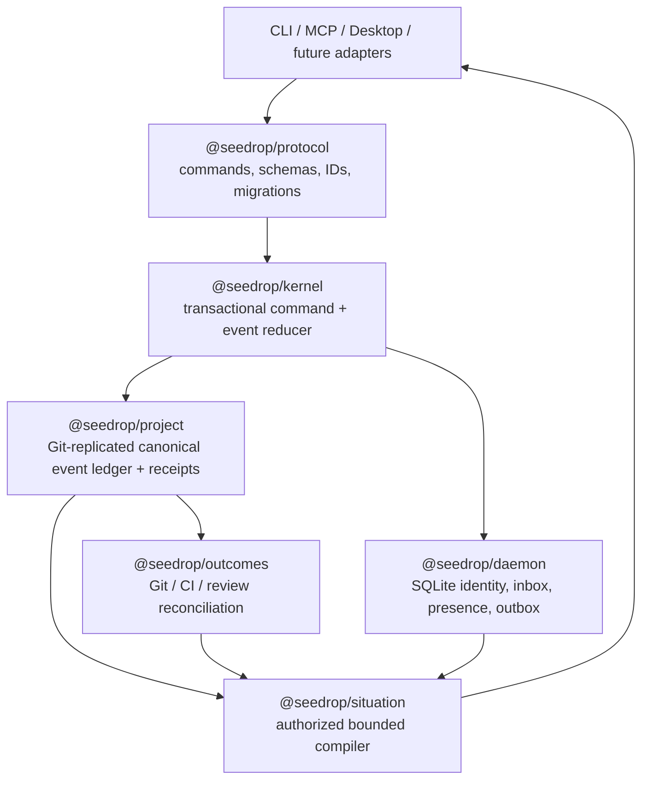

# Seedrop v2 — Provable Continuity

**Status:** product and architecture thesis, grounded in the 2026-08-08 code and machine-corpus audit  
**Companion evidence:** [machine evidence](./MACHINE-EVIDENCE.md), [system forensics](./SYSTEM-FORENSICS.md), [Seedrop DB experiment forensics](./SEEDROP-DB-EXPERIMENT.md), [evidence-based redemption plan](./EVIDENCE-BASED-PLAN.md), [migration snapshot and restore](./SNAPSHOT-RESTORE.md), [durable v1 freeze](./DURABLE-V1-FREEZE.md), [backlog reconciliation](./BACKLOG-RECONCILIATION.md)

## Verdict

Seedrop has the right macro shape and the wrong center of gravity.

It is physically an npm-workspaces monorepo and logically a modular package system. The dependency graph is acyclic and sensible:

```text
id       space
 \       /  \
  \     /    observer -> bench
    cli
     |
    mcp

desktop -> packaged CLI/observer runtime
```

That is good. V2 should **keep a modular monolith in one repository**. Splitting production packages into repositories or network services would add version skew and operational failure without repairing Seedrop's actual problem.

The separate `seedrop_db` repository is an off-trajectory experiment, not a v2 dependency or delivery risk. V2 proceeds on the simplest reliable in-repo substrate. The database path may be reconsidered only after independently preregistered, reproducible evidence shows approximately 10× end-to-end Seedrop product value; storage microbenchmarks or semantic equivalence are insufficient.

The actual problem is that state ownership is fragmented. Runs, tasks, continuity packets, manifests, signals, Git, the daemon, boot, Observer, Bench, and Desktop can each tell a different version of “what is happening.” The package boundaries are healthier than the runtime truth boundaries.

## Product thesis

Seedrop v2 should be the **provable continuity control plane for humans and heterogeneous agents**.

Its north-star guarantee:

> A cold agent can take the correct next action, without repeating dead work or losing uncommitted work, within a bounded context budget—and every material claim is linked to current evidence.

Seedrop is not primarily:

- another agent memory store;
- a project-management board;
- a chat system;
- an orchestration framework;
- a generated `AGENTS.md` file.

Those can be inputs or projections. The product is the trusted transition between “someone worked here” and “the next actor can safely continue.”

## The category to create

Current products cover pieces of the problem:

- repository instructions tell an agent how to behave;
- agent memories preserve reusable facts;
- task queues record intended work;
- Git and CI prove what landed;
- chat records what people said.

The open product position is a vendor-neutral, local-first layer that reconciles all of them into one evidence-bearing resumption decision. Seedrop can own that category because the existing system already has the necessary raw materials: persistent identity, repo-local View state, run journals, negative knowledge, live coordination, validation receipts, Git outcome analysis, and deterministic boot routing.

The differentiation should be stated narrowly and testably:

1. **Every orientation fact is a claim.** It has provenance, observed time, freshness, confidence, and invalidation rules.
2. **Every command is a state transition.** It is atomic, idempotent, attributable, and repairable.
3. **Every reported completion is reconciled.** Reported work is distinct from committed, merged, reverted, superseded, or absent work.
4. **Failures survive.** Abandoned approaches and causes are first-class evidence, not missing telemetry.
5. **Context budget is a contract.** Reads do not build an unbounded world and trim it afterward.
6. **Unknown is explicit.** Corruption, stale projections, unreachable daemons, and ambiguous ownership never become empty success.

## What to preserve, fix, and elevate

| Preserve | Fix before expansion | Elevate into the product |
| --- | --- | --- |
| One repo with modular packages | Multiple sources of truth for one work episode | Evidence graph / continuity ledger |
| Stable machine-level passport identity | Alias identities and frozen daemon snapshots | Canonical principal identity across clients |
| Repo-local, Git-friendly View | Silent artifact skipping and schema drift | Quarantine, migration, and explainable repair |
| Runs with validation and changed paths | Non-atomic multi-artifact transitions | Transactional, resumable commands |
| Negative-knowledge “graves” | Failure under-reporting and stale active runs | Automatic failure inference with confidence |
| Thin MCP wrappers over CLI behavior | Hand-maintained CLI/MCP contract drift | Generated adapters from one protocol schema |
| Local daemon and durable Space | Nested data-root semantics and weak authorization | Machine-local transactional coordination core |
| Git outcome layer | “Completed” used as delivery proof | Reported/evidence/delivery status separation |
| Deterministic boot decision trace | One L0–L4 ladder mixing unrelated dimensions | Multi-axis readiness and explicit uncertainty |
| Desktop sealed-runtime/release controls | Desktop re-deriving incomplete state | Human repair/explanation surface over one projection |

## Canonical model

V2 needs fewer public nouns but richer evidence.

### Durable entities

- **Principal** — canonical identity, with client aliases as attributes rather than identities.
- **Project** — a canonical repo/worktree identity with known roots.
- **Intent** — the unit of wanted work; replaces ambiguous task/handoff/thread overlap.
- **Episode** — an execution attempt against an intent; evolves from Run.
- **Claim** — a proposition about project state with provenance and freshness.
- **Receipt** — validation, Git, CI, review, or delivery evidence.
- **Lease** — time-bounded concurrency ownership.
- **Event** — the immutable record of a command and its result.

### Orthogonal status axes

Do not compress these into one “success level”:

| Axis | Example states |
| --- | --- |
| Work lifecycle | queued, active, paused, blocked, reported_complete, abandoned |
| Evidence | unverified, passed, failed, stale, unavailable |
| Delivery | uncommitted, committed, review_open, merged, reverted, superseded, absent |
| Substrate health | healthy, degraded, corrupt, migrating, unreachable |
| Handoff readiness | not_ready, resumable_with_risk, ready |
| Confidence | observed, inferred_high, inferred_low, unknown |

This makes the machine truth expressible: a run can be `reported_complete + passed + uncommitted + resumable_with_risk` without lying or losing useful information.

## Target modular architecture



### `@seedrop/protocol`

One generated contract for command inputs, events, stable error codes, state transitions, schema versions, and migration chains. CLI parsers, MCP JSON Schema, and Desktop types are generated or checked against it.

### `@seedrop/kernel`

The only package allowed to execute state-changing commands. A command validates expected versions, writes one canonical event transactionally, advances projections, and records an outbox item for external effects. Retries use an idempotency key.

### `@seedrop/project`

The repo-owned durable record. Keep canonical event bytes content-addressed, verifiable, and portable through Git. Use one immutable command-transaction file per atomic project write and a disposable local SQLite index for acceleration. Machine coordination remains in the transactional daemon store. Neither cache becomes a second narrative.

### `@seedrop/daemon`

The machine-owned transactional record for principals, project registry, inbox, presence, memberships, notifications, and the outbox. SQLite is appropriate here. Store one canonical root and migrate today's nested root explicitly.

### `@seedrop/situation`

A bounded compiler over authoritative evidence. It answers a small set of questions—what is true, what is uncertain, what changed, what is unsafe, and what should happen next—using validity, authorization, proof closure, contradiction preservation, graves, indexes, and evidence references. It returns a deterministic Situation envelope at or below the requested byte/token ceiling.

The main-path implementation belongs in this modular monorepo and uses the existing Seedrop corpus as its executable reference. It does not wait for or embed the database experiment.

### `@seedrop/outcomes`

Continuously reconciles reported work with Git, CI, pull requests, and explicit operator decisions. Its output never overwrites the historical report; it adds delivery evidence and invalidations.

## What the Seedrop DB experiment taught

It strengthens the v2 thesis in four ways:

1. **Situation is the native product read.** It is a deterministic compilation target, not a summary template.
2. **Truth, semantics, and acceleration are separate planes.** Immutable events govern; projections and indexes are disposable.
3. **Correctness gates performance.** A candidate cannot publish speed for a cell that fails validity, authorization, proof, contradiction, budget, recovery, or typed-failure semantics.
4. **The custom database is falsifiable.** SQLite or another existing-store composition should win if it meets the same semantics near the same performance with lower complexity.

Those lessons influence the contract, not the dependency graph. No v2 task depends on `seedrop_db`, and no parallel ledger is introduced. If the independent experiment eventually produces black-on-white 10× product-level evidence, it will receive a fresh integration decision rather than entering through architectural momentum.

## The Situation envelope

The primary V2 read should be one stable envelope:

```json
{
  "situation_version": "2.0",
  "project": {},
  "active_intent": {},
  "next_action": {},
  "risks": [],
  "unknowns": [],
  "relevant_graves": [],
  "inbox": [],
  "evidence_refs": [],
  "health": {},
  "budget": { "requested_bytes": 4096, "actual_bytes": 3981, "complete": false },
  "explain": { "decision_id": "...", "projection_version": "..." }
}
```

Every field must declare whether it is observed, derived, stale, or missing. “Nothing returned” is never allowed to mean both “there is nothing” and “the reader failed.”

## Product experience

The best product loop is:

1. **Connect once.** Seedrop discovers identity, project roots, clients, and existing View evidence.
2. **Orient in one bounded fetch.** The agent receives Situation plus evidence references.
3. **Work through commands.** Changes append one canonical event; adapters do not invent state.
4. **Prove.** Validation and delivery receipts attach to the episode.
5. **Reconcile.** Git/CI/review evidence updates delivery status after the session ends.
6. **Resume or repair.** The next actor gets a safe action; the human UI explains uncertainty and offers an explicit repair.

Desktop should become the operator’s explanation and repair console for this loop. It should not become a second router or state oracle. The current Desktop remains a developer preview until the signed/notarized release verification gate passes.

## SOTA acceptance tests

V2 is not SOTA because it has more features. It is SOTA when it can pass adversarial guarantees that current memory and task products do not attempt together:

- two processes claim/update the same intent concurrently and exactly one valid transition wins;
- a process dies after every individual write boundary and recovery reaches one valid state;
- one corrupt artifact is quarantined and visible while all valid history remains queryable;
- a 10-year/100k-event project returns a correct 4 KiB Situation without scanning the repo;
- an identity alias cannot create a second principal or bypass membership authorization;
- an unauthorized/private lifecycle event cannot change the visible cardinality or validity of a reader's Situation;
- cache identity changes for every authorization and output dimension, including canonical policy contents, graves, strictness, proof mode, principal, world state, snapshot, ranker, and budget;
- a “completed” episode with no surviving Git/CI evidence is shown as reported, not delivered;
- reverted and superseded work remains explainable and does not pollute current guidance;
- a stale claim is invalidated when its source changes;
- a missing daemon produces an explicit degraded state, not empty coordination;
- every UI and adapter produces the same next action for the same projection version.
- a real-corpus resumption suite produces useful Situations at an accepted coverage rate; correctness is not reported only over the successful minority.

## Strategic boundary

The audit is strong longitudinal dogfood evidence, not market validation. It spans many real repos and hundreds of runs on one operator’s machine; it proves recurrent product and reliability problems in authentic use. It does not prove demand, collaboration patterns, or platform constraints across teams. V2 should first establish its kernel guarantees on this corpus, then recruit a small set of external design partners around the north-star resumption test—not around a broad “agent memory” pitch.

## Relevant external baseline

- [GitHub Copilot Memory](https://docs.github.com/en/copilot/concepts/agents/copilot-memory) stores repository-scoped facts with citations and revalidation.
- [Cursor Memories](https://docs.cursor.com/en/context/memories) stores project-scoped memories created from conversations or tool use.
- [OpenAI’s Codex workflow guide](https://openai.com/business/guides-and-resources/how-openai-uses-codex/) describes repository instructions and a lightweight task queue as persistent context.
- [MCP’s 2026-07-28 release candidate](https://blog.modelcontextprotocol.io/posts/2026-07-28-release-candidate/) moves toward full JSON Schema and OpenTelemetry while deprecating older roots/sampling/logging primitives.

These are inputs and interoperability constraints, not Seedrop’s product definition.
