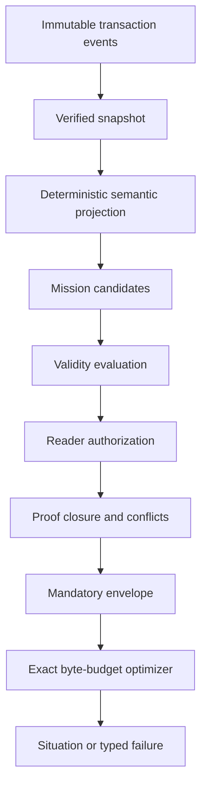
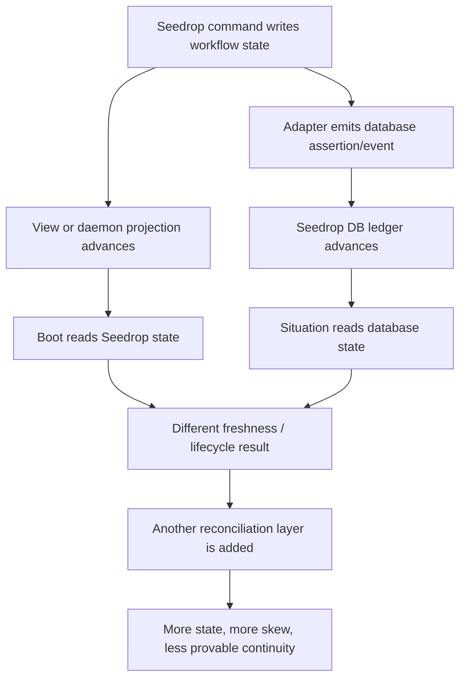

# Seedrop DB — V2 Architectural Experiment Forensics

**Audit date:** 2026-08-08  
**Scope:** `/Users/mc/Projects/seedrop_db`, including accepted architecture, G1 reference semantics, G2 candidates, frozen Day-0 contracts, observed local results, and current Seedrop continuity  
**Authority:** explicit user request to include the early database experiment in the Seedrop v2 analysis  
**Verdict:** retain as an independent off-trajectory experiment; v2 takes no runtime, migration, or scheduling dependency on it  
**Superseding trajectory decision:** after this forensic audit, the user set a stronger promotion bar: reconsider integration only after independently preregistered, reproducible evidence demonstrates approximately 10× end-to-end Seedrop product value. G2/G3 correctness or storage speed alone is insufficient.

## 1. Actual State Machine

`seedrop_db` has a clearer stage machine than Seedrop itself:

```text
G0 charter accepted
  -> G1 semantic reference accepted and frozen
  -> G2 competitive proof active
     -> correctness-complete candidate cells
     -> performance/resource measurement on D2/D3
     -> continue | stop | narrow decision
  -> G3 Seedrop conformance
  -> G4 operational readiness
```

The current durable state is **G2 active, incomplete**. G3 native integration is explicitly blocked. The root README still says no G2 task has started, while the repo-local View and active Run say G2 is in progress. That disagreement is itself useful Seedrop evidence: even an experiment built to solve orientation already demonstrates why a compiled Situation must carry source freshness and governing-record identity.

The implemented query state machine is:



That is the right conceptual center for v2. It makes orientation a correctness-bearing compilation step rather than a large best-effort summary.

The physical experiment contains five distinct candidates or roles:

| ID | Current role | Observed state |
| --- | --- | --- |
| R0 | exhaustive in-memory semantic oracle | G1 frozen; all 64 D0 histories govern semantics |
| I0 | file/View composition baseline | D0 conformance implemented; no complete observed G2 result |
| B1 | SQLite plus application semantics | original D1 miss preserved; revision-5 D1 correctness passes C1–C14 |
| B2 | pinned Kuzu baseline | adapter exists; conformance test requires its pinned Python environment and is ignored locally |
| C0 | checksummed segment ledger plus disposable bitmap projection | D1 correctness passes C1–C14; performance not observed |

The strongest observed evidence is exact D1 correctness for C0 and the repaired B1 adapter. Both reported 85 successful Situations and 915 typed failures across the same 1,000 frozen requests. That proves agreement with R0. It does not yet prove useful Boot/View output, production performance, or a reason for the custom physical store to exist.

## 2. State Transition Failure Table

| Transition or boundary | Current implementation | Failure mode | Required disposition before promotion |
| --- | --- | --- | --- |
| Seedrop command becomes database truth | Seedrop and `seedrop_db` have separate proposed event/ledger models | two authoritative histories can disagree about the same Run, Task, claim, or grave | G3 must choose one canonical event identity and define import/export as replication, not dual writing |
| private assertion supersedes visible assertion | projection applies all supersession/lifecycle events before reader authorization; authorization is checked later per surviving assertion | an unauthorized/private superseder can make an otherwise visible assertion disappear, leaking hidden activity through result cardinality | add combined authorization × lifecycle D0 fixtures and change semantics so hidden state cannot affect a reader-visible projection without authorized policy effect |
| Situation cache lookup | `CacheKey` includes policy version but not policy contents; it also omits `include_graves` and `strict` | two requests with different grants or output obligations can collide when versions are reused | hash the full canonical principal and policy plus every behavior-affecting request field; extend L4 tests |
| strict/proof-policy request | `strict` is never consumed and `ReferencesAllowed` has no separate compiler behavior; frozen requests always use strict + inline proof | the public request surface promises modes that the semantic oracle does not distinguish | either implement and fixture both modes or remove them in a versioned contract change |
| corrupt C0 projection opens | binding mismatch is discarded, but checksum/format corruption aborts adapter open | ADR 0004 promises corrupt disposable projection discard plus deterministic rebuild, but implementation can turn cache corruption into database unavailability | treat disposable projection corruption as diagnosed rebuild state; preserve typed failure if authoritative ledger is corrupt |
| append followed by latest Situation | append marks the entire index dirty; the next query rebuilds the full current index from all event locations | mixed production traffic can pay a full-history rebuild after each write batch and hides projection lag behind query latency | incremental projection application, explicit applied snapshot, tail catch-up, and `projection_behind` behavior |
| first append after clean open | clean open scans zero historical frames, but lazy duplicate-ID index construction scans all historical transactions on first write | W2 can pass while the first real command remains history-bound | persist/rebuild a durable or checkpointed event-ID set, and measure first-write latency separately |
| performance gate | only correctness and preregistration runners exist; result schema explicitly forbids performance observations | no evidence exists for the 3× G2 continuation bar, the 10× novelty bar, resource limits, or stop/narrow rule | implement the frozen performance harness, required ablations, raw observation retention, and official D3 run on an eligible host |
| semantic correctness becomes product usefulness | D1 has 8.5% successful Situations and 91.5% correctly typed failures | a system may be perfectly equivalent to R0 while rarely producing an actionable orientation packet | preserve Day-0 results, then add a separate G3 Seedrop resumption/usefulness benchmark with success coverage and safe-next-action scoring |
| documentation becomes current state | README says G1/no G2 task while View/Run records active G2 work | a human or agent following the static entry point receives a stale gate decision | generated/current gate badge must name its governing record and freshness; static prose remains explanatory only |

The authorization/lifecycle and cache-key findings are semantic-contract gaps, not C0-only implementation details. Passing C0 and B1 against the same R0 oracle cannot detect a defect shared by the oracle and every adapter.

## 3. Source of Truth Inventory

| Domain | Current source | Competing source | V2 assessment |
| --- | --- | --- | --- |
| product mission | Seedrop product and v2 thesis | database category language | Seedrop owns safe resumption; the database is an enabling kernel, not the user-facing product definition |
| semantic truth | frozen R0 contracts, D0 histories, accepted invariants | implementation behavior in C0/B1/I0/B2 | R0 correctly governs G2, but shared-oracle blind spots need a preserved defect record and successor fixtures before G3 |
| authoritative experiment history | C0 checksummed event segments | normalized B1 rows and I0 transaction files | C0 is only a candidate until the frozen performance/complexity decision is complete |
| derived query state | disposable C0 projection checkpoints/indexes | SQLite derived tables, I0 View projection | correctly treated as rebuildable; corruption and lag behavior are not yet fully implemented |
| Seedrop workflow state | current View Runs, Tasks, packets, Signals, daemon state | proposed `seedrop_db` coordination module | G3 must map or move authority deliberately; the database must not silently become a parallel workflow journal |
| repo portability | committed `.seedrop/view` files and Git history | local binary C0 ledger | unresolved: v2 needs one canonical byte identity plus verifiable Git replication/export if the active database is binary |
| gate decision | frozen Day-0 benchmark and acceptance records | README status prose and active Run | the benchmark/ADR records govern; prose and View are projections with freshness |
| production readiness | no source yet | green unit/conformance suites | test health is necessary but cannot substitute for G2 performance, G3 migration, or G4 crash/corruption/release proof |

The correct ownership boundary is two kernels with different responsibilities, not two truths:

- the **workflow kernel** validates Seedrop commands, lifecycle transitions, idempotency, leases, and outbox effects;
- the **Situation kernel** verifies authoritative evidence and compiles the authorized, validity-filtered, proof-closed, bounded read.

They may share one canonical project event stream. If they persist independently, one must be an explicitly lagged replica/materialization with a verifiable source watermark.

## 4. Unchecked Assumptions

| Assumption | Evidence against it | Risk |
| --- | --- | --- |
| passing the oracle proves safety | authorization-sensitive lifecycle and complete cache identity are not covered by the frozen fixtures | every adapter can agree on the same unsafe outcome |
| passing D1 correctness means G2 is nearly complete | there is no performance runner or result; B2 is not exercised locally; D2/D3 decisions are absent | premature production integration and sunk cost in C0 |
| quality ratio 1.0 means useful orientation | 915/1,000 requests are typed failures; the ratio is computed only over 85 successes | benchmark headline can hide low answer coverage |
| zero-frame clean open means history-independent operation | first append builds the duplicate-ID set by scanning history; post-append query rebuilds the whole index | attractive W2 result with poor mixed-workload behavior |
| a disposable checkpoint always heals itself | checksum corruption currently aborts open | a cache failure becomes an availability failure |
| policy version uniquely identifies policy content | callers can construct different grant maps under the same version string | authorization-crossing cache collision if caching is enabled |
| request fields are implemented because they are serialized | `strict` and non-inline proof policy are not used by compilation | false API capability and incomplete cache semantics |
| a custom database is the moat | repaired SQLite now matches all D1 correctness gates with application logic included | the moat may be Situation semantics/compiler, not custom storage |
| a separate repo proves a good permanent production split | it currently has one consumer, a coupled G3 target, and a stale status surface | release/version skew without independent lifecycle benefit |
| binary local truth preserves Seedrop's Git-portable View guarantee | no accepted export/replication contract connects C0 event bytes to committed repo evidence | clone/resume and human review can regress |

## 5. Confusion Cascade

Premature integration would create a new version of Seedrop's current failure pattern:



The experiment should collapse this cascade, not become another source inside it. The promotion path is therefore one-way and gated:

```text
accepted Situation semantics influence v2 protocol now
  -> shared-oracle safety gaps are closed and preserved as new evidence
  -> G2 decides C0 vs existing-store composition
  -> G3 proves one canonical Seedrop event mapping and migration
  -> G4 proves recovery, corruption, packaging, and rollback
  -> only then does the implementation enter the production dependency graph
```

This does not overturn the original modular-monolith recommendation. A separate repository is useful while the physical engine is an experiment with a legitimate kill/narrow gate. If it passes and still co-evolves with only Seedrop, bringing the Rust crates into the Seedrop repository preserves modular code while avoiding contract skew. A permanently separate release should be earned by independent consumers or a demonstrably independent compatibility lifecycle.

## 6. Next Steps

The following are experiment-side possibilities, not Seedrop v2 main-path tasks. The Seedrop plan neither blocks on them nor schedules them in its active backlog.

1. Keep `seedrop_db` separate and G3 blocked. Do not add it to the Seedrop runtime, Desktop payload, daemon, or release path yet.
2. Adopt the **Situation** noun and its validity, provenance, contradiction, authorization, graves, decision-trace, and exact-byte-budget obligations into `@seedrop/protocol`. Treat the existing Rust types as evidence, not yet as the public v2 wire contract.
3. Record a semantic-gap ADR in `seedrop_db`. Preserve `day-0-v0.1` and its observed results; add successor fixtures for hidden lifecycle effects, full cache identity, strict/non-strict behavior, inline/reference proof policy, policy-content reuse, and workspace-boundary behavior under independently accepted safety requirements.
4. Finish the frozen G2 decision: implement the performance harness, run I0/B1/B2/C0 with application logic and canonical serialization included, execute required ablations, and produce D3 results on a host meeting the 32 GiB reference minimum. Accept stop/narrow if B1 is within the frozen bar.
5. Add a separate G3 product benchmark using the real Seedrop corpus. Measure successful Situation coverage, correct intent/risk/grave/next-action recovery, unsupported confidence, duplicate work, bytes, and time-to-safe-action. Do not rewrite Day-0 to make a product metric appear as a storage result.
6. Define one-ledger portability before implementation: canonical event bytes and IDs; active local transaction store; content-addressed Git replication/export; high-watermarks; import/replay; conflict preservation; and explicit degraded behavior when local DB and committed View differ.
7. If the experiment first satisfies the separate 10× product-value promotion contract, propose a fresh Seedrop integration ADR and narrow vertical slice. Until then, do not build G3 integration machinery in the Seedrop repository.
8. Decide source topology only in that future integration ADR. No current default assumes the engine crates will enter the Seedrop monorepo.
9. Keep Desktop a developer preview throughout this work. Native database integration does not relax the signed, notarized, clean-machine `release:verify` gate.

**Promotion rule:** semantic lessons may inform design, but Seedrop v2 does not prototype against or depend on the experiment. Reopening integration requires frozen 10× end-to-end product evidence first, followed by a new explicit architecture decision and the applicable conformance/operational gates.
