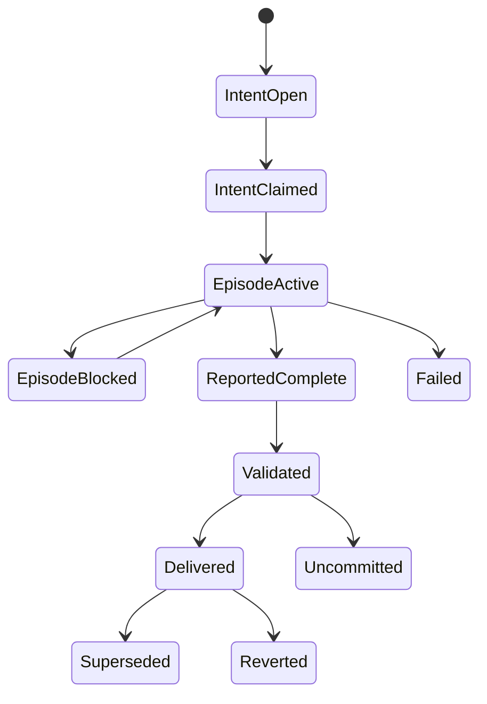
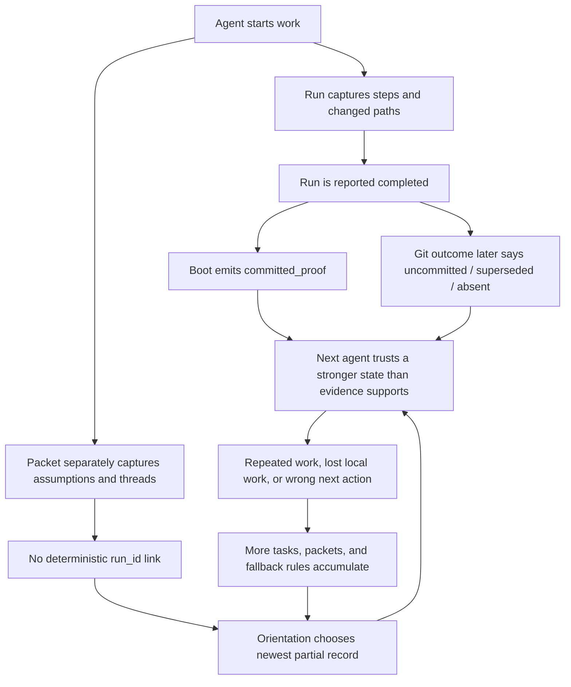

# Seedrop v2 — System Forensics

**Audit date:** 2026-08-08  
**Scope:** `id`, `space`, `cli`, `mcp`, `observer`, `bench`, `desktop`, release controls, live daemon storage, nine passports, and 17 meaningful Views

## 1. Actual State Machine

Seedrop exposes five user-visible enum state machines with 21 named states:

| Machine | Explicit states | Owner today |
| --- | --- | --- |
| Run | `in_progress`, `completed`, `blocked`, `failed` | repo files via `space` View code |
| Task | `open`, `claimed`, `in_progress`, `blocked`, `done`, `dropped` | repo files via `space` View code |
| Space lifecycle | `open`, `active`, `ended`, `archived` | daemon files/SQLite via `space` |
| Legacy Handoff | `pending`, `accepted` | frozen repo files plus migration code |
| View success | `L0` through `L4` | derived by `space`, interpreted by CLI/UI |

That explicit model is only a fraction of the actual state machine. At least twelve implicit dimensions affect behavior without being modeled as one authoritative transition system:

1. repository dirtiness and whether changed paths are tracked;
2. inferred delivery outcome: survived, uncommitted, superseded, or absent;
3. artifact validity versus silently skipped corruption;
4. daemon reachable versus degraded/offline;
5. principal alias chosen in the request header;
6. membership versus presence versus cached local session;
7. active versus abandoned-but-unswept run;
8. manifest and knowledge freshness;
9. continuity watermark advanced versus peeked;
10. context budget requested versus exceeded;
11. source, `dist`, or sealed Desktop runtime in use;
12. projection freshness across CLI, boot, Observer, Bench, and Desktop.

The resulting system is combinatorial. A Run can be explicitly `completed`, inferred `uncommitted`, accepted by boot as `committed_proof`, absent from a Desktop field, and linked to no continuity packet—all at once.

The intended flow is:



Today only the left half is explicit. The evidence and delivery half is inferred later and is not part of the same transition model.

**Critical question:** Which states are historical claims, which are current projections, and which are authoritative enough to block the next action?

## 2. State Transition Failure Table

| Transition | Current implementation | Failure mode | Resulting state |
| --- | --- | --- | --- |
| `run finish` | mutates a locked Run object, then releases claims, creates handoff task, syncs manifest, reads packets, and finally writes the Run | process/error after a side effect but before final Run write | claims/tasks/manifest say finished while Run remains `in_progress` |
| task claim/assign/start/done | read, check, mutate, overwrite; no cross-process compare-and-swap | two processes pass the same precondition | lost update, double claim, terminal-state resurrection |
| task start/pause | permissive state assignment | `start` can reopen terminal tasks; `pause` can change a terminal task to blocked | history is rewritten as current state |
| task create with dedup key | scan then create | concurrent creators see no existing task | duplicate intent/handoff/thread materialization |
| Space join/meta update | read-modify-overwrite with only an in-process write queue | daemon/CLI or two processes write concurrently | lost member or lifecycle update |
| message post plus mentions | message append occurs before mention creation | mention/outbox failure after message persistence | caller sees failure, retry duplicates message |
| passport update | some routes use commit journal; general `id update` writes passport directly | crash/concurrent writer bypasses audit atomicity | audit/passport disagreement or lost update |
| View read | many `safeList*` methods catch parse failures | one artifact becomes invalid | valid query appears empty or incomplete without health evidence |
| schema evolution | schemas remain strict `1.0`; migration chains are empty | a writer adds fields or stores ergonomic prefixes | current data is rejected and hidden |
| daemon identity refresh | passport watcher mutates resolver, but server captures startup arrays for several checks | new/changed identity appears after start | resolver, health, known-ID chain, and authorization disagree |
| principal resolution | passport ID, agent ID, and name are accepted aliases; raw header is persisted as passport ID | same person uses different alias | split presence, inbox, attribution, and memberships |
| continuity read | non-peek read registers presence and advances watermark | partial daemon fetch or a nominally read-only boot | messages can be considered seen despite incomplete retrieval |
| View sync | recursively hashes the whole tree; run finish swallows failure | large repositories exceed MCP timeout | manifest remains stale while run still reports completion |
| MCP subprocess | fixed 15-second timeout, SIGTERM without forced escalation; output cap slices strings as bytes | large sync/output or non-terminating child | ambiguous cancellation and potentially invalid truncated JSON |
| Desktop command bridge | waits for child exit before draining piped stdout/stderr | child fills pipe buffer | child and UI wait until timeout |

The most serious transition defect is not “files instead of a database.” It is that one user command spans several independently persisted truths without a transaction, event journal, outbox, or repair state.

**Critical question:** What is the atomic unit of user intent, and can every interruption point deterministically replay or roll it back?

## 3. Source of Truth Inventory

| Domain | Claimed source | Competing/derived sources | Forensic assessment |
| --- | --- | --- | --- |
| Identity | passport JSON | request aliases, sessions cache, daemon startup snapshots | durable but not canonical at request boundary |
| Project registry | passport `active_projects` | cwd discovery, per-agent passports, Desktop inventory | duplicated roots and no one canonical project ID |
| Work intent | Task files | run goals, packet threads, inbox messages, boot candidates | fragmented and weakly linked |
| Execution | Run files | continuity packets, Git history, task status | strongest existing spine, but rationale and delivery live elsewhere |
| Reasoning | continuity packets | run decisions/assumptions/threads, knowledge annotations | dual-written; packets lack deterministic Run linkage |
| Delivery | Git/CI reality | Run `completed`, packet Git status, boot trust labels | Git is external truth, but current product elevates self-report too early |
| Validation | Run/packet receipts | command text, cached audits, CI state | useful evidence without freshness/invalidation model |
| Coordination | daemon Space store | JSON sessions, passport membership, client caches | live root is physically split and authorization is under-specified |
| Concurrency | Signal files | task ownership, active runs, presence | leases and ownership can contradict each other |
| Orientation | View context/brief | bare `seed`, continuity, focus, boot, Observer, Bench, Desktop buckets | many projections independently encode product policy |
| Health | View audit and doctor | parser stderr, cached audit, Desktop aggregate status | incomplete artifact coverage; corruption can be invisible |
| Product contract | README/manual/ADR | live capabilities and schemas | documentation already reports different primitive/tool counts |

The architectural dependency graph is clean: `id` and `space` are foundations; `cli` composes them; `mcp` wraps CLI; `observer` reads `id`/`space`; Bench and Desktop consume projections. The truth graph is not clean because `space` owns the daemon, project files, schemas, migrations, tasks, runs, policy, sync, audit, context compilation, and much of product behavior.

**Critical question:** For each user-visible sentence in Situation, can Seedrop name exactly one canonical record and the deterministic projection that produced it?

## 4. Unchecked Assumptions

| Assumption in behavior | Evidence that breaks it | Risk |
| --- | --- | --- |
| `completed` is sufficient trust evidence | about 21% of classified completed runs did not survive at current `HEAD`; 66 completed runs have no passed validation | unsafe “committed proof” label |
| artifact parse failure can be treated as absence | two live task files fail current schema and disappear from list results | lost work masquerades as empty state |
| one JavaScript process is the only writer | CLI, MCP subprocesses, daemon, agents, and humans can all touch state | in-process write queues do not prevent lost updates |
| a path prefix accepted by the CLI is safe to persist | a live `blocked_by` prefix violates the stored UUID schema | writer/read-contract drift |
| a requested context budget can be met by trimming afterward | all meaningful Views exceeded 2,048 bytes; full arrays are loaded first | cost and latency scale with history regardless of output |
| a fresh manifest can be obtained synchronously | Seedrop's ~38k-file workspace sync exceeded the MCP timeout | orientation/finish paths become unbounded |
| success is one ordered ladder | L3 needs an active evidenced run while handoff readiness and substrate health are independent | honest states become impossible or oscillatory |
| every ID alias is interchangeable | raw header aliases are persisted as `passportId` | one principal becomes several coordination actors |
| a successful message request is one effect | message and mentions persist separately | retries can duplicate or omit notifications |
| watchers make server identity dynamic | several server closures keep startup snapshots | runtime behavior diverges after passport changes |
| “read continuity” is observational | it can register presence and advance a watermark | inspection changes coordination state |
| Desktop can safely reinterpret Observer data | Desktop discards resumption evidence and computes task progress with `done = 0` | human layer contradicts agent layer |
| migration exists because migration infrastructure exists | all durable schemas remain `1.0` and migration chains are empty | schema changes become strict-parser failures |
| test volume covers reliability | 774 tests pass while live root nesting, hidden tasks, and budget failure remain | local correctness masks systemic failure modes |

**Critical question:** Which assumptions should become enforced invariants, and which should become explicit `unknown` states with operator-visible evidence?

## 5. Confusion Cascade

The dominant cascade begins with a legitimate work episode and ends in a confident but unprovable next action:



A second cascade turns corruption into absence:

```text
writer emits schema-invalid field
  -> strict reader rejects artifact
  -> safeList catches and skips it
  -> audit does not inspect that artifact family
  -> boot/Observer/Desktop see an empty or smaller queue
  -> operator or agent creates replacement work
  -> duplicate/conflicting intent becomes the new truth
```

A third cascade turns scale into staleness:

```text
repo grows
  -> sync/context scan all files and records
  -> MCP/Desktop timeout or block
  -> error is swallowed or shown as degraded
  -> manifest/projection stays stale
  -> more repair candidates and fallback reads are added
  -> every future orientation becomes larger and slower
```

These are structural cascades. UI polish or more routing heuristics will not fix them; every new projection currently magnifies the number of places that can disagree.

**Critical question:** What is the smallest canonical event and projection model that removes a whole cascade rather than adding another compensating read path?

## 6. Next Steps

1. Freeze ontology and schema additions until the v2 canonical event, entity, and status-axis model is accepted.
2. Repair live data safety first: expose all malformed artifact families, fix/migrate the nested Space root, stop treating parse failure as absence, and stop boot from labeling self-reported completion as committed proof.
3. Introduce `@seedrop/protocol` as the sole source for schemas, commands, errors, migrations, CLI/MCP contracts, and Desktop types.
4. Introduce a transactional kernel with expected-version checks, idempotency keys, an append-only event record, and an outbox for secondary effects.
5. Fold Run and continuity-packet evidence into one Episode ledger; generate handoff/situation projections rather than dual-writing them.
6. Replace L0–L4 with orthogonal lifecycle, evidence, delivery, substrate-health, handoff-readiness, and confidence axes.
7. Build indexed, hard-budget orientation and incremental repo observation. A read must not scale with all history or all repository files.
8. Make Git/CI/review reconciliation a first-class outcome subsystem and retain both the original report and later evidence.
9. Reduce CLI, MCP, Observer, Bench, and Desktop to adapters/projections over the same kernel. Keep Desktop in developer preview until its signed/notarized sealed-runtime gate passes.
10. Prove the architecture on the existing 737-run corpus with concurrency, crash-injection, corruption, migration, parity, and large-history tests before expanding product surface.

**Critical question:** Will v2 optimize first for a compelling demo, or for the trust guarantees required to make the demo true after months of real multi-agent use?
